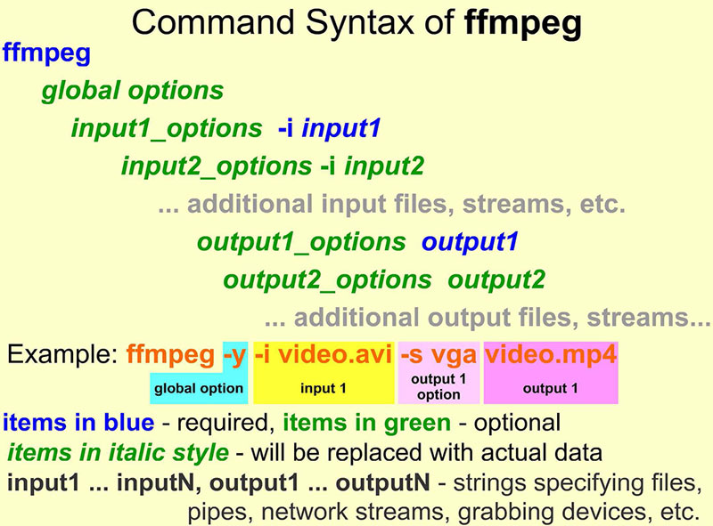

## 1. FFmpeg 简介
万丈高楼平地起
...

| FFmpeg 命令行工具大全 |                                        |
| --------------------- | -------------------------------------- |
| ffmpeg                | 快速 音频/视频 编解码                  |
| ffplay                | 媒体播放器                             |
| ffprobe               | 显示媒体文件特征                       |
| ffserver              | 使用HTTP和RTSP协议的多媒体流广播服务器 |

| FFmpeg 软件库 |                            |
| ------------- | -------------------------- |
| libavcodec    | 各种多媒体编解码器的软件库 |
| libavdevice   | 设备软件库                 |
| libavfilter   | 包含过滤器的软件库         |
| libavformat   | 媒体格式的软件库           |
| libavutil     | 包含各种实用程序的软件库   |
| libpostproc   | 后处理软件库               |
| libswresample | 音频重采样软件库           |
| libswscale    | 用于媒体缩放的软件库       |

全部由C语言编写，多平台支持。

## 2. FFmpeg 开发人员
...
## 3. 参与 FFmpeg 开发
...

## 4. 下载地址
- 主要下载地址：http://ffmpeg.org/download.html

## 5. 命令行语法
ffmpeg命令行工具的语法相对简单，重要的是在正确的位置键入所需的参数，并且不要在各种输入和输出之间混合使用选项。 ffmpeg命令的一般结构如下，全局选项影响所有输入和输出：

    ffmpeg [global options] [input file options] -i input_file [output file options] output_file

## 6. Windows命令提示符及其替代方法
| 替代方案       |                                        |                                                                                                            |
| -------------- | -------------------------------------- | ---------------------------------------------------------------------------------------------------------- |
| 名称           | 下载地址                               | 说明                                                                                                       |
| FAR Manager    | farmanager.com                         | 1.带shell、编辑器、FTP客户端的文件管理  2.命令行完成，快捷方式，宏，插件  3. 2个窗口，可自定义的界面 |
| PyCmd          | sourceforge.net/projects/pycmd         | tab 补全，持久化历史记录                                                                                   |
| Console        | sourceforge.net/projects/console       | 多标签，可配置                                                                                             |
| Gregs DOSShell | gammadyne.com/cmdline.htm#gs           | 改进了编辑，命令历史记录，对Aero Glass的支持等。                                                           |
| TCC/LE         | jpsoft.com/alldownloads/downloads.html | 包括111个内部命令，103个内部变量，140个变量功能                                                            |

...

## 7. 配置环境变量

## 8. 重命名命令使用缩写更方便
ffmpeg.exe -> f.exe

## 9. 显示输出预览
在各种视频测试过程中，我们可以通过直接在屏幕上显示命令输出来节省大量时间，而不是将命令输出保存到文件中，而是在媒体播放器中预览。
### FFplay中预览
而不是使用ffmpeg工具使用简化命令生成新文件，以下是ffmpeg命令生成到新文件

    ffmpeg -i input_file ... test_options ... output_file

我们可以使用以下命令使用ffplay显示与ffmpeg保存到文件完全相同的内容

    ffplay -i input_file ... test_options

### 使用SDL输出设备预览
...

## 10. FFmpeg中可用的SI前缀
当为各种ffmpeg选项（例如比特率或最大文件大小）指定数值时，可以使用常见的SI后缀：K代表千（103），M代表兆（106），G代表千兆（109），等等。下一个示例指定了新的比特率1.5 输出文件每秒兆位，所有命令给出的结果相同：

    ffmpeg -i input.avi -b:v 1500000 output.mp4
    ffmpeg -i input.avi -b:v 1500K output.mp4
    ffmpeg -i input.avi -b:v 1.5M output.mp4
    ffmpeg -i input.avi -b:v 0.0015G output.mp4

## 11. 使用ffmpeg进行转码

